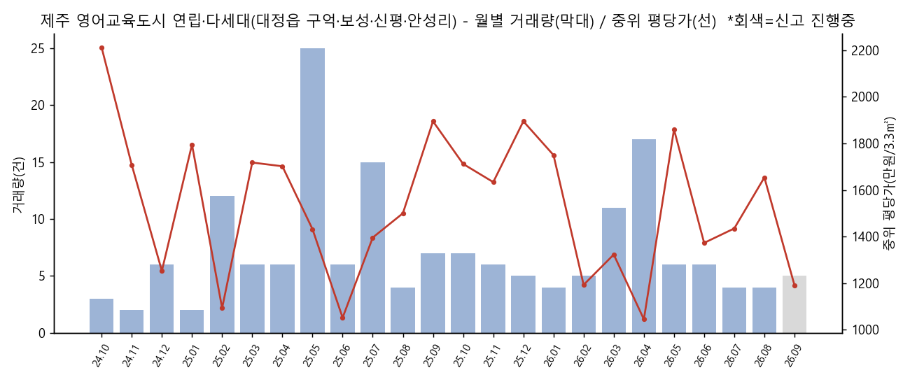
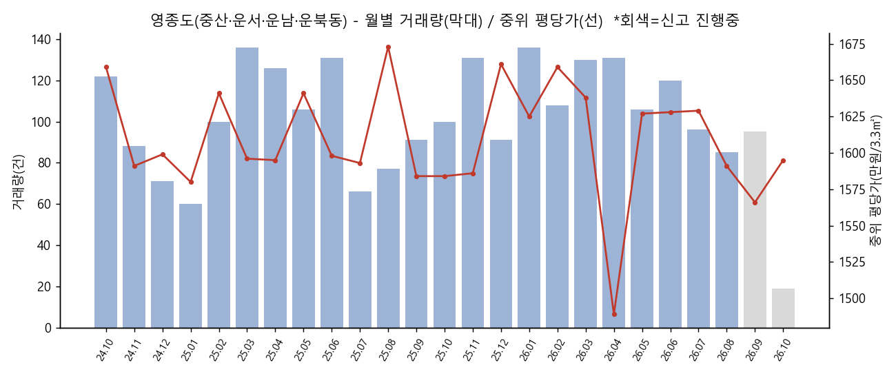
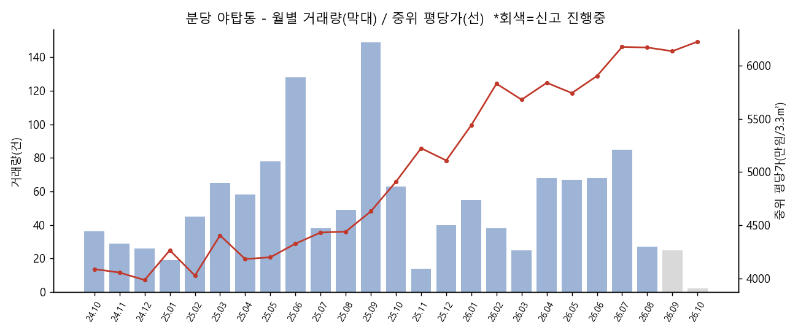
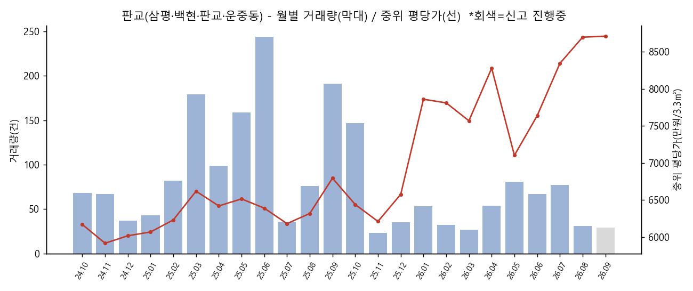
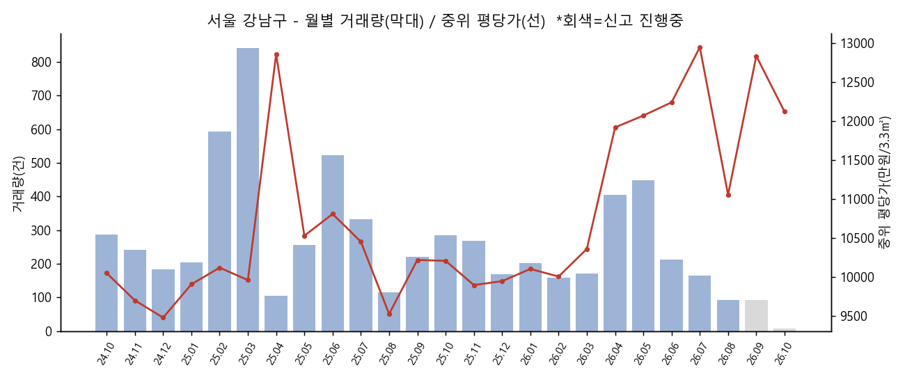
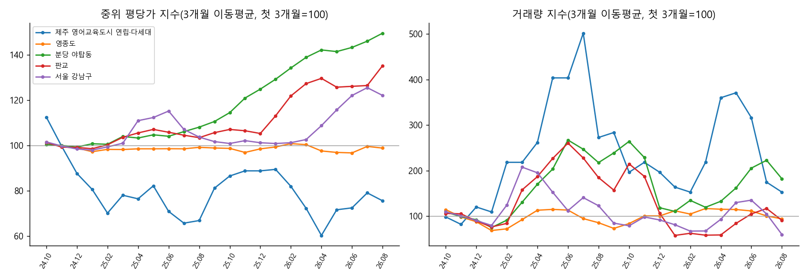

# 06. 관심지역 아파트 실거래가 동향 (2024.10 ~ 2026.10)

작성일: 2026-10-09 / 데이터 기준: 국토교통부 실거래가 공개시스템, 2026-10-09 수집 (계약일 기준)

> 이 문서는 판단 재료를 모은 것이며 투자 권유가 아닙니다. 모든 수치는 실제로 수집한 데이터이거나, 출처 URL을 밝힌 보도 내용입니다.

---

## ① 핵심 요약 (지역별 한 줄)

| 지역 | 한 줄 요약 |
|---|---|
| **제주 영어교육도시** (대정읍 구억·보성·신평리) | 24개월 동안 이 3개 리에서 **'아파트' 매매는 0건**입니다. 실제 거래는 연립·다세대(타운하우스형) 189건(안성리 포함)이고 월 4~17건 수준입니다. 중위 평당가는 1,000만~1,900만원대에서 단지 구성에 따라 크게 출렁입니다. 제주 전체 미분양이 역대 최대이고, 하향 거래가 섞여 있습니다. |
| **영종도** (중산·운서·운남·운북동) | 거래량은 최근 12개월 1,329건으로 직전 12개월보다 **+13%** 늘었습니다. 가격은 **횡보**입니다(동일 단지 기준 전년 대비 **-1.8%**, 중위 평당가 약 1,560만~1,660만원). 제3연륙교(청라하늘대교)가 2026년 1월 개통했지만 가격 반등은 데이터에 보이지 않습니다. 같은 시기 미분양 관리지역으로 지정됐습니다. |
| **분당 야탑동** | 다섯 곳 중 상승이 가장 강합니다. 동일 단지 기준 **전년 대비 +39.1%**, 중위 평당가는 4,909만원(2025.10)에서 약 6,140만원(2026.08~09)이 됐습니다. 최근 거래의 **43%가 신고가**입니다. 1990년대 노후 단지(매화·탑·장미·목련마을) 위주이고, 재건축 선도지구 기대가 겹쳐 있습니다. |
| **판교** (삼평·백현·판교·운중동) | 거래량은 **-49%**(1,281건 → 656건)로 줄었지만 가격은 동일 단지 기준 **전년 대비 +20%** 올랐습니다. 중위 평당가는 약 8,700만원(2026.08~09)입니다. 신고가 비율은 39%입니다. |
| **서울 강남구** | 거래량은 **-32%**(3,906건 → 2,674건)입니다. 2026년 8~9월은 월 93건(9월은 잠정)으로 바닥 수준입니다. 동일 단지 기준 가격은 전년 대비 **+2.8%**에 그쳐 사실상 정체입니다. 압구정·대치·개포 재건축 단지에서 직전 12개월 중위가보다 10% 넘게 낮은 거래가 23건 나왔습니다. 신고가 비율은 16%로 분당(44%)보다 훨씬 낮습니다. |

**핵심 대비:** 2025.10~2026.09 사이 *분당(야탑·판교)은 거래가 줄면서 가격이 크게 올랐고*, *강남은 거래가 줄면서 가격이 정체·조정을 보였고*, *영종·제주는 거래는 유지되나 가격이 정체·약세*입니다.

---

## ② 데이터 출처와 수집 방법 (수집일 2026-10-09)

| 구분 | 출처 | 방법·범위 |
|---|---|---|
| 아파트 매매 실거래(주 데이터) | 국토교통부 실거래가 공개시스템 [rt.molit.go.kr](https://rt.molit.go.kr/pt/xls/xls.do?mobileAt=) '자료제공' CSV | 시군구 × 월 단위로 2024-10~2026-10 다운로드(키 불필요). 서귀포시 50130, 인천 영종구 28155, 분당구 41135, 강남구 11680. 총 22,245건, 그중 해제(취소) 1,597건은 집계에서 제외 |
| 누락 월 보완 | 같은 시스템 지도조회의 단지별 조회 (`ptDanjiList.do` → `ptDtl.do`) | CSV는 **하루 다운로드 100건 한도**가 있습니다. 한도에 걸린 영종구 2026-08~10은 단지별 조회로 채웠습니다. 2026-07 건수로 검증했더니 CSV 99건, 단지 조회 99건으로 일치했습니다 |
| 제주 영어교육도시 | 같은 단지별 조회. 대정읍(5013025000)의 **연립·다세대** | 구억·보성·신평·안성리 소재 단지 189건(2024-10 이후) |
| 정책·교통·미분양 | 언론 보도 (본문 각 항목에 URL) | WebSearch/WebFetch |
| R-ONE(한국부동산원) | `reb.or.kr/r-one/openapi` | 키 없이 호출하면 "데이터 없음"이 반환돼 수치를 직접 받지 못했습니다. 주간 변동률은 보도를 인용했습니다 |
| 공공데이터포털 API | `apis.data.go.kr/1613000/RTMSDataSvcAptTrade` | 키가 없어 401 응답. 스크립트만 완성해 두었습니다(⑥ 참고) |

**행정구역 변경 주의:** 2026-07-01 인천 행정체제 개편으로 **중구(28110)가 폐지됐습니다.** 영종도는 **영종구(28155)**가 됐고 공개시스템도 과거 거래를 소급해 재코드했습니다. 그래서 28110으로 조회하면 0건이 나옵니다. 개편 근거: [경기일보 2026-06-30](https://www.kyeonggi.com/article/20260630580520), [뉴스서울](https://newsseoul.co.kr/news/view/1065585033516846)

**지표 정의**
- ㎡당 가격 = 거래가 ÷ 전용면적. 평당 가격 = ㎡당 가격 × 3.3058. 단위는 만원이고 전용면적 기준입니다(공급면적 기준 시세보다 높게 나옵니다).
- **신고가**: 2024-10 이후 같은 단지·같은 전용면적(정수 ㎡)의 기존 최고가를 넘은 거래입니다. 데이터 기간 안에서의 최고가라 '역대 최고가'와는 다를 수 있습니다. 집계 대상은 2026-07-01 이후 계약입니다.
- **하락 거래**: 같은 단지·면적의 직전 12개월 거래(3건 이상) 중위가보다 10% 이상 낮은 거래입니다. 저층이나 직거래 영향이 섞일 수 있습니다.
- **동일 단지 쌍 비교**: 2026-06~08 동안 같은 단지·면적의 중위가를 직전 3개월, 전년 같은 기간과 짝지어 비교하고, 변화율의 중앙값을 냈습니다. 단지 구성이 달라서 생기는 착시를 줄이는 지표입니다.
- **9~10월은 잠정치**입니다. 신고 기한이 계약 후 30일이라 2026-09 거래량은 앞으로 늘어납니다. 차트에서는 회색으로 표시했습니다.

---

## ③ 지역별 상세

### 3-1. 제주 영어교육도시 (서귀포시 대정읍 구억·보성·신평리 + 안성리)



- **아파트 매매 0건(24개월)**: 대정읍에서 아파트 매매는 하모·상모·동일리에서만 35건(해제 4건 포함) 있었고, 영어교육도시 3개 리에서는 한 건도 없었습니다. 이 일대 주거는 대부분 5층 미만 연립·다세대(타운하우스형)입니다. 신규 아파트인 포레나 제주에듀시티(보성리, 503세대, 지상 5층)는 아직 분양 중이라 재거래 기록이 없습니다.
  ([세계일보 2026-06-29](https://www.segye.com/newsView/20260628508016))
- 그래서 **연립·다세대 거래로 대신 분석했습니다.** 2024-10 이후 189건이고, 리별로 보성 112, 구억 41, 안성 36건입니다.

| 월 | 25.10 | 25.11 | 25.12 | 26.01 | 26.02 | 26.03 | 26.04 | 26.05 | 26.06 | 26.07 | 26.08 | 26.09* |
|---|---|---|---|---|---|---|---|---|---|---|---|---|
| 거래량 | 7 | 6 | 5 | 4 | 5 | 11 | 17 | 6 | 6 | 4 | 4 | 5 |
| 중위가(만원) | 34,900 | 40,000 | 46,600 | 43,000 | 23,523 | 27,500 | 19,016 | 51,625 | 30,350 | 27,250 | 42,500 | 21,500 |
| 중위 ㎡당 | 518 | 494 | 573 | 529 | 361 | 400 | 316 | 563 | 415 | 434 | 501 | 360 |
| 중위 평당 | 1,712 | 1,634 | 1,895 | 1,750 | 1,193 | 1,323 | 1,045 | 1,860 | 1,373 | 1,435 | 1,654 | 1,191 |

- 12개월 거래량: 직전 94건 → 최근 80건(**-15%**).
- 동일 단지 쌍 비교는 쌍이 5개뿐이라 참고만 하십시오. 직전 3개월 대비 -2.3%, 전년 동기 대비 +2.8%입니다.
- 표본이 작아 월별 중위가는 어떤 단지(소형 원룸형인지 130㎡ 타운하우스인지)가 거래됐느냐에 따라 크게 흔들립니다.

**대표 단지 최근 거래**

| 단지 | 위치 | 12개월 거래 | 주력면적 최근 거래 | 기간 최고 |
|---|---|---|---|---|
| 삼정G.edu | 보성리 | 23 | 84㎡ 4.8억 (2026-08-11, 3층) | 6.5억 |
| 라온프라이빗에듀 | 보성리 | 9 | 59㎡ 1.7억 (2026-09-10, 1층) | 3.5억 |
| 해동그린앤골드 | 구억리 | 6 | 84.9㎡ 5.8억 (2026-08-22) | 7.0억 (84.9㎡) |
| 제주영어교육도시꿈에그린 | 보성리 | 6 | 130㎡ 7.5억 (2026-06-08) | 8.6억 |

- **신고가·하락 (2026.7~)**
  - 신고가 1건: 캐논스빌리지Ⅱ 63.6㎡ 2.3억(직거래)
  - 하락 2건: 라온프라이빗에듀 59.99㎡ 1.7억(직전 12개월 중위 2.83억 대비 -40%), 삼정G.edu 59.7㎡ 2.15억(-14%)
- **특이사항**
  - 제주 미분양 3,303호(2026년 7월 말)로 통계 작성 이후 처음 3,000호를 넘었습니다. 준공 후 미분양은 2,364호로 역대 최대이고, 그중 서귀포시가 1,004호(준공 후 997호)입니다. ([제이누리 2026-09-01](https://www.jnuri.net/news/article.html?no=69858))
  - 5번째 국제학교 FSAA(풀턴 사이언스 아카데미 애서튼)가 착공해 2028년 8월 개교를 목표로 합니다. 기존 학교는 KIS·NLCS·BHA·SJA 4곳입니다. ([세계일보](https://www.segye.com/newsView/20260628508016))
  - 직거래 비중이 월 0~100%로 높고 변동이 큽니다(예: 2025-07 93%). 개별 계약 사정이 가격에 섞여 있을 가능성이 있습니다.

### 3-2. 영종도 (인천 영종구 중산·운서·운남·운북동)



| 월 | 25.10 | 25.11 | 25.12 | 26.01 | 26.02 | 26.03 | 26.04 | 26.05 | 26.06 | 26.07 | 26.08 | 26.09* |
|---|---|---|---|---|---|---|---|---|---|---|---|---|
| 거래량 | 100 | 131 | 91 | 136 | 108 | 130 | 131 | 106 | 120 | 96 | 85 | 95 |
| 중위가(만원) | 37,500 | 39,200 | 41,000 | 36,950 | 35,900 | 37,750 | 33,000 | 39,750 | 38,600 | 40,250 | 35,200 | 36,900 |
| 중위 ㎡당 | 479 | 480 | 503 | 492 | 502 | 496 | 450 | 492 | 492 | 493 | 481 | 474 |
| 중위 평당 | 1,584 | 1,586 | 1,661 | 1,625 | 1,659 | 1,638 | 1,489 | 1,627 | 1,628 | 1,629 | 1,591 | 1,566 |

- 12개월 거래량: 1,174건 → 1,329건(**+13.2%**). 다섯 지역 중 유일하게 늘었습니다(비규제 지역).
- 2026-06~08: 거래 301건, 중위 평당 1,608만원. 직전 3개월은 367건·1,602만원, 전년 동기는 274건·1,620만원입니다.
- 동일 단지 쌍 비교: 직전 3개월 대비 **+0.3%**(58쌍), 전년 대비 **-1.8%**(49쌍)로 **가격은 횡보에서 약보합**입니다.

| 대표 단지 | 동 | 준공 | 12개월 거래 | 주력면적 최근 거래 | 기간 최고 | 12개월 중위 |
|---|---|---|---|---|---|---|
| 하늘도시우미린1단지 | 중산 | 2012 | 103 | 59㎡ 2.75억 (10-03) | 3.18억 | 2.81억 |
| 인천영종한양수자인 | 중산 | 2012 | 87 | 59㎡ 2.85억 (10-07) | 3.35억 | 2.85억 |
| e편한세상영종국제도시오션하임 | 중산 | 2018 | 76 | 84㎡ 4.0억 (09-27, 3층) | 5.0억 | 4.35억 |
| e편한세상영종국제도시센텀베뉴 | 중산 | 2023 | 65 | 84㎡ 5.2억 (10-08) | 5.63억 | 5.1억 |
| 운서SKVIEW Skycity | 운서 | 2022 | 65 | 84㎡ 4.4억 (09-22) | 5.0억 | 4.53억 |

- **신고가 (2026.7~): 5건 / 295건(1.7%)**
  - 영종오션파크모아엘가그랑데 84.9㎡ 4.83억(+12.3%)
  - 영종자이 138.6㎡ 5.5억(+10.2%)
  - 스카이시티자이 99㎡ 6.2억 등
- **하락 거래: 11건**
  - 센텀베뉴 84㎡ 4.4억(직전 12개월 중위 5.1억 대비 -13.7%, 3층)
  - 금호베스트빌1단지 84㎡ 2.65억(-13.4%)
  - 운서SKVIEW skycityⅡ 84.9㎡ 3.9억(-12.3%) 등. 대부분 저층입니다.
- **특이사항**
  - **제3연륙교(청라하늘대교)가 2026-01-05 개통했습니다.** 4.68km, 영종·청라 주민 무료이고, 2026-04-06부터 인천시민 전체 무료입니다. ([인사이트](https://www.insight.co.kr/news/536049), [경향신문](https://www.khan.co.kr/article/202601141710001/), [헤럴드경제](https://www.heraldk.com/article/2026032216323037008)) 그러나 개통 전후로 중위 평당가는 1,600만원 안팎에서 움직이지 않았습니다. 거래량은 개통 직후인 2026-01에 136건으로 다소 늘었습니다.
  - **미분양 급증**: 옛 인천 중구 미분양은 2025-12 33호에서 2026-01 1,683호로, 2026-05에는 1,810호가 됐습니다. 2026년 7월 HUG 미분양관리지역으로 지정됐고, 신규 분양 84㎡는 5억~6억원대입니다. ([헤럴드경제 2026-07-08](https://www.heraldk.com/article/2026070823465460837)) 신축 분양가가 기존 단지 시세(84㎡ 4억~5억원대)보다 높아서 기존 단지 가격을 누르는 구조로 보입니다(해석).
  - 2026-07-01 영종구가 출범했습니다(행정 코드 변경).

### 3-3. 분당 야탑동



| 월 | 25.10 | 25.11 | 25.12 | 26.01 | 26.02 | 26.03 | 26.04 | 26.05 | 26.06 | 26.07 | 26.08 | 26.09* |
|---|---|---|---|---|---|---|---|---|---|---|---|---|
| 거래량 | 63 | 14 | 40 | 55 | 38 | 25 | 68 | 67 | 68 | 85 | 27 | 25 |
| 중위가(만원) | 90,700 | 94,100 | 91,250 | 98,800 | 104,000 | 105,000 | 112,100 | 99,000 | 105,500 | 108,000 | 111,700 | 105,900 |
| 중위 ㎡당 | 1,485 | 1,580 | 1,546 | 1,646 | 1,764 | 1,719 | 1,767 | 1,737 | 1,786 | 1,869 | 1,867 | 1,857 |
| 중위 평당 | 4,909 | 5,224 | 5,109 | 5,442 | 5,831 | 5,681 | 5,840 | 5,743 | 5,904 | 6,177 | 6,172 | 6,137 |

- 12개월 거래량: 720건 → 575건(**-20%**). 2025-11에는 14건으로 급감했는데, 10·15 대책으로 토지거래허가구역이 적용된 직후입니다.
- 2026-06~08: 180건, 중위 평당 6,081만원. 직전 3개월은 5,763만원, 전년 동기는 4,362만원입니다.
- 동일 단지 쌍 비교: 직전 3개월 대비 **+6.7%**(39쌍), **전년 대비 +39.1%**(45쌍).
- **신고가 60건 / 최근 거래 139건(43%), 하락 거래 0건.**

| 대표 단지 | 준공 | 12개월 거래 | 주력면적 최근 거래 | 기간 최고 |
|---|---|---|---|---|
| 매화마을공무원2 | 1995 | 146 | 58㎡ 10.8억 (09-23) | 11.76억 |
| 장미마을(현대) | 1993 | 74 | 41㎡ 9.8억 (07-17) | 9.8억 |
| 매화마을공무원1 | 1995 | 53 | 58㎡ 10.59억 (09-28) | 11.3억 |
| 매화마을(주공4) | 1993 | 34 | 35㎡ 7.85억 (09-22) | 7.95억 |
| 탑마을(주공) | 1993 | 32 | 35㎡ 8.97억 (09-17) | 8.97억 |

- **상승률 상위 신고가**
  - 탑마을(주공) 36㎡ 8.7억(+30.3%)
  - 매화마을(주공3) 46.2㎡ 9.5억(+28.4%)
  - 탑마을(벽산) 134.8㎡ 19억(+27.5%)
  - 목련마을(한신) 59.9㎡ 10.45억(+21.5%)
  - 장미마을(동부) 70.6㎡ 15.3억(+16.8%)
- **특이사항**
  - 10·15 대책으로 성남 분당구가 투기과열지구·조정대상지역·토지거래허가구역에 포함됐습니다. LTV는 무주택자 40%이고 유주택자는 대출이 금지됐습니다. ([헤럴드경제](https://www.heraldk.com/article/2025101816500228400))
  - **1기 신도시 재건축**: 분당 선도지구 특별정비구역 지정이 2026년 1월 마무리됐습니다(양지마을 1/27 고시). 이어 시범·샛별·목련(6·S3 결합구역, LH)·양지마을의 사업시행자 지정이 2026년 6~7월에 끝났습니다. 목련마을은 야탑동 소재입니다. ([헤럴드경제](https://www.heraldk.com/article/2026012700553511684), [데일리안](https://www.dailian.co.kr/news/view/1671228/)) 거래 상위가 모두 1993~95년 준공 소형 평형이라는 점이 재건축 기대 수요와 맞아떨어집니다.

### 3-4. 판교 (삼평·백현·판교·운중동)



| 월 | 25.10 | 25.11 | 25.12 | 26.01 | 26.02 | 26.03 | 26.04 | 26.05 | 26.06 | 26.07 | 26.08 | 26.09* |
|---|---|---|---|---|---|---|---|---|---|---|---|---|
| 거래량 | 147 | 23 | 35 | 53 | 32 | 27 | 54 | 81 | 67 | 77 | 31 | 29 |
| 중위가(만원) | 165,000 | 160,000 | 178,500 | 175,000 | 179,500 | 167,000 | 175,000 | 182,000 | 175,000 | 192,500 | 188,000 | 192,000 |
| 중위 ㎡당 | 1,948 | 1,879 | 1,989 | 2,378 | 2,363 | 2,290 | 2,505 | 2,149 | 2,311 | 2,524 | 2,632 | 2,636 |
| 중위 평당 | 6,439 | 6,211 | 6,576 | 7,861 | 7,812 | 7,570 | 8,281 | 7,103 | 7,638 | 8,345 | 8,699 | 8,713 |

- 12개월 거래량: 1,281건 → 656건(**-48.8%**). 2025년 3월과 6월, 9~10월에 몰렸던 거래가 대책 이후 사라졌습니다.
- 동일 단지 쌍 비교: 직전 3개월 대비 **+4.3%**(52쌍), **전년 대비 +20.0%**(63쌍).
- **신고가 53건 / 137건(39%), 하락 거래 0건.**

| 대표 단지 | 동 | 준공 | 12개월 거래 | 주력면적 최근 거래 | 기간 최고 |
|---|---|---|---|---|---|
| THE SHARP 판교퍼스트파크 | 백현 | 2021 | 53 | 84㎡ 15.47억 (09-02) | 16.8억 |
| 산운마을13단지(태영) | 운중 | 2010 | 40 | 84㎡ 16.65억 (06-17) | 17.5억 |
| 판교원마을6단지(대광로제비앙) | 판교 | 2009 | 30 | 58㎡ 15.35억 (09-22) | 15.55억 |
| 판교원마을11단지(힐스테이트) | 판교 | 2009 | 26 | 118㎡ 20억 (09-11) | 20억 |

- **주요 신고가**
  - 봇들마을3단지(주공) 84.7㎡ 23.5억(직전 최고 17.5억 대비 +34%)
  - 백현마을2단지 84.5㎡ 28억(평당 약 1.1억)
  - 판교푸르지오그랑블 99㎡ 31억
  - 판교알파리움1단지 142㎡ 38억
  - 산운마을14단지 184.6㎡ 34.75억(+56%, 대형)
- **특이사항**: 분당구 전체가 10·15 규제 3중 지정을 받았습니다. 백현·삼평 중대형 단지가 평당 1억원 안팎에 거래되기 시작했습니다(백현마을2·5단지 84㎡ 이하 평당 약 1.1억).

### 3-5. 서울 강남구



| 월 | 25.10 | 25.11 | 25.12 | 26.01 | 26.02 | 26.03 | 26.04 | 26.05 | 26.06 | 26.07 | 26.08 | 26.09* |
|---|---|---|---|---|---|---|---|---|---|---|---|---|
| 거래량 | 286 | 268 | 169 | 203 | 158 | 171 | 405 | 449 | 213 | 166 | 93 | 93 |
| 중위가(억) | 23.0 | 24.1 | 20.1 | 23.0 | 23.35 | 21.5 | 26.8 | 27.0 | 27.7 | 28.65 | 28.5 | 27.65 |
| 중위 ㎡당(만원) | 3,088 | 2,994 | 3,009 | 3,056 | 3,027 | 3,134 | 3,606 | 3,652 | 3,703 | 3,917 | 3,344 | 3,883 |
| 중위 평당(만원) | 10,208 | 9,897 | 9,947 | 10,104 | 10,006 | 10,361 | 11,920 | 12,072 | 12,241 | 12,949 | 11,056 | 12,836 |

- 12개월 거래량: 3,906건 → 2,674건(**-31.5%**).
  - 2025-02~03에 594건·842건으로 급증했다가, 토허구역이 재지정된 2025-04에는 106건으로 떨어졌습니다.
  - **2026-04~05에 405건·449건으로 반짝 늘었습니다.** 다주택자 양도세 중과 유예가 2026-05-09에 끝나기 전 막차 매도가 몰린 때입니다.
  - 이후 6월 213건 → 7월 166건 → 8월 93건으로 줄었습니다.
- 2026-06~08: 472건, 중위 평당 1억2,403만원. 직전 3개월은 1,025건·1억1,702만원, 전년 동기는 970건·1억489만원입니다. 중위 평당가 상승은 고가 단지 거래 비중이 바뀐 영향이 큽니다.
- **동일 단지 쌍 비교: 직전 3개월 대비 +3.2%(191쌍), 전년 대비 +2.8%(178쌍)로 사실상 정체입니다.**
- **신고가 57건 / 359건(16%), 하락 거래 23건**(그중 직거래 35%).

| 대표 단지 | 동 | 준공 | 12개월 거래 | 주력면적 최근 거래 | 기간 최고 |
|---|---|---|---|---|---|
| 까치마을 | 수서 | 1993 | 82 | 34㎡ 15.3억 (09-18) | 15.5억 |
| 성원대치2단지 | 개포 | 1992 | 74 | 33㎡ 15.95억 (06-27) | 16.55억 |
| 개포자이프레지던스 | 개포 | 2023 | 73 | 84㎡ 39.5억 (07-18) | 42.7억 |
| 도곡렉슬 | 도곡 | 2006 | 64 | 84㎡ 35.7억 (09-15) | 40억 |
| 개포래미안포레스트 | 개포 | 2020 | 55 | 59㎡ 26.5억 (09-06) | 30.8억 |

- **신고가 예**
  - 도곡 우성4 126㎡ 49.2억(+26%)
  - 대치푸르지오써밋 60㎡ 30억(+20%)
  - 청담자이 89㎡ 56억(+10.9%)
  - 압구정 신현대11차 170.8㎡ 93억(+9.4%)
- **하락 거래 예 (직전 12개월 중위 대비)**
  - 은마 76.8㎡ 30.2억(-13.7%, 2층)
  - 개포주공7단지 83.7㎡ 32.5억(-16.9%)
  - 압구정 현대8차 107.6㎡ 49억(-13.7%)
  - 개포주공5단지 54㎡ 21.1억(-28.7%, 직거래)
  - 한보미도맨션1 128㎡ 38.8억(-16.3%, 직거래)
- **특이사항**
  - 2025년 3월 강남3구·용산구 전체가 토허구역으로 확대 지정됐습니다(데이터상 2025-04 거래 106건으로 급감). 10·15 대책으로 서울 전역이 토허구역·규제지역이 됐습니다. ([헤럴드경제](https://www.heraldk.com/article/2025101816500228400))
  - **2026-05-09 다주택자 양도세 중과 유예가 끝났습니다.** 이후 서울 6월 매매 계약은 4,783건으로 5월의 약 55%에 그쳤고, 서울 토허 신청은 5,382건(4월 대비 -39.7%)이었습니다. ([MTN 2026-07-10](https://news.mtn.co.kr/news-detail/2026071016303724598), [경북매일](https://www.kbmaeil.com/article/20260719500285))
  - **2026-08-03 세제개편안(정부안)**: 고가·비거주·다주택 종부세를 강화하고, 공정시장가액비율을 2028년 최대 80%까지 올리는 안입니다. 아직 국회 통과 전입니다. ([경향신문](https://www.khan.co.kr/article/202608031800021/amp)) 데이터에서도 2026-08 거래가 93건으로 급감했습니다.
  - 한국부동산원 주간 통계에서 강남구는 2026년 5월 첫째 주까지 11주 연속 하락했습니다. ([스마트투데이](https://www.smarttoday.co.kr/ko-kr/articles/107296)) 9월 넷째 주에는 **-0.56%**(압구정·대치 중심)로, 서울 전체 +0.09%(86주 연속 상승)와 반대로 움직였습니다. ([인사이트 2026-10-01](https://www.insight.co.kr/news/576172)) 실거래 데이터의 압구정·대치·개포 하락 거래와 방향이 같습니다.

---

## ④ 지역 비교 인사이트



| 지역 | 12개월 거래량 변화 | 동일 단지 가격 전년 대비 | 동일 단지 직전 3개월 대비 | 최근 3개월 중위 평당 | 신고가 비율(7월~) |
|---|---|---|---|---|---|
| 제주 영어교육도시(연립·다세대) | -15% | +2.8% (5쌍, 신뢰 낮음) | -2.3% | 1,450만원 | 8% (1/13) |
| 영종도 | **+13%** | **-1.8%** | +0.3% | 1,608만원 | 2% |
| 분당 야탑동 | -20% | **+39.1%** | +6.7% | 6,081만원 | **43%** |
| 판교 | **-49%** | +20.0% | +4.3% | 7,978만원 | 39% |
| 서울 강남구 | -32% | +2.8% | +3.2% | 12,403만원 | 16% |
| (참고) 분당구 전체 | -34% | +29.1% | +4.4% | 7,365만원 | 44% |

*12개월 거래량 = 2025.10~2026.09 vs 2024.10~2025.09 (양쪽 모두 9월은 신고 진행 영향 있음). 중위 평당은 2026.06~08 기준*

1. **'규제 + 거래 급감 + 가격 상승'은 분당에서만 나타났습니다.** 같은 10·15 규제를 받았는데 강남은 정체, 분당(야탑·판교)은 20~39% 상승입니다. 강남 대비 상대 가격(판교 평당 약 0.64배, 야탑 약 0.49배), 재건축 선도지구 진척, 고가주택 세제 강화(32억원 초과 등)에서 상대적으로 비켜 있는 가격대가 함께 작용했을 가능성이 있습니다(해석).
2. **강남은 거래가 정책 일정에 끌려다녔습니다.** 2025-02~03 토허 해제기에 급증, 2025-04 재지정 후 급감, 2026-04~05 양도세 중과 전 급증, 2026-08 세제개편안 후 급감이라는 패턴이 실거래 월별 건수에 그대로 찍혀 있습니다. 하락 거래의 35%가 직거래라 가족 간 거래 같은 비시장 거래도 섞여 있습니다.
3. **영종은 교통 호재보다 공급 부담이 더 크게 작용했습니다.** 다리 개통 후에도 가격은 약보합이고, 거래량만 비규제 효과로 유지됐습니다. 미분양 1,810호와 신규 분양가 5억~6억원대가 기존 단지 시세의 상단을 막고 있는 모습입니다.
4. **제주 영어교육도시는 '아파트 실거래' 통계에 잡히지 않는 시장입니다.** 연립·다세대 기준으로 봐야 하고, 거래가 월 한 자릿수라 개별 거래 하나가 지표를 흔듭니다. 제주 전체 준공 후 미분양이 역대 최대인 것을 함께 보아야 합니다.
5. **해제(취소) 신고가 시장 과열기에 급증합니다.** 분당구 2025-06 해제 158건(거래 1,274건의 12%), 강남 2025-03 75건이 그 예입니다. 해제 건수도 과열 신호로 쓸 수 있습니다.

---

## ⑤ 한계와 다음 단계

**한계**
- 공개시스템 CSV는 하루 100건 다운로드 한도가 있습니다. 이번에는 한도에 걸린 영종 2026-08~10을 단지별 조회로 보완했고, 이 구간은 건축년도와 도로명이 비어 있습니다.
- 2026-09~10은 신고 진행 중이라 거래량이 과소 집계돼 있습니다. 10월 말에 다시 돌리면 9월이 확정됩니다.
- '신고가'는 2024-10 이후 기간 안의 최고가 기준입니다. 역대 최고가 여부는 더 긴 기간 데이터가 필요합니다.
- 중위 평당가는 거래 단지 구성에 민감합니다. 그래서 가격 판단은 '동일 단지 쌍 비교'를 우선하십시오. 제주는 쌍이 5개뿐이라 신뢰도가 낮습니다.
- 전용면적 기준이라 공급면적 기준 '평당가'(언론·포털 표기)보다 약 1.3배 높게 나옵니다.
- R-ONE·KB 지수는 키 없이 받지 못해 보도 인용으로 대신했습니다. 분당·인천·제주의 최신 주간 변동률은 확보하지 못했습니다.

**다음 단계 제안**
1. 공공데이터포털 키를 받아 `fetch_molit_api.py`로 수집하면 한도 없이 5년치 이상을 모아 '역대 신고가' 판정이 가능합니다.
2. 같은 방식으로 **전월세(RTMSDataSvcAptRent)**를 수집해 전세가율을 보십시오. 영종·제주의 약세 판단에 유용합니다.
3. 제주는 `jeju_edu_town.py`에 안덕면 서광리 등 인접 지역과 **분양권(E)**을 추가하면 신규 단지 움직임을 볼 수 있습니다.
4. R-ONE Open API 키를 받으면 주간 매매가격지수(시군구)를 붙여 실거래 지표와 교차 검증할 수 있습니다.

---

## ⑥ 재실행 방법

```bash
cd "06_아파트실거래가/scripts"
pip install pandas requests matplotlib tabulate truststore   # truststore: 사내망 SSL 인증서 문제 해결용

# A) 키 없이: 국토부 공개시스템 CSV (하루 100회 한도, data/raw 캐시 재사용, 최근 2개월만 다시 받음)
python fetch_rt_public.py --from 2024-10 --to 2026-10
python fetch_rt_danji.py            # 한도 초과로 빠진 월(data/missing_months.txt)을 단지별 조회로 보완
python jeju_edu_town.py             # 제주 영어교육도시 연립·다세대 수집
python analyze.py --asof 2026-10-09 # 집계 + 차트 (data/*.csv, data/analysis_tables.md, charts/*.png)

# B) API 키가 있을 때: 공공데이터포털 API
#   PowerShell:  $env:MOLIT_API_KEY = "<일반 인증키(Decoding)>"
#   bash:        export MOLIT_API_KEY="<일반 인증키(Decoding)>"
python fetch_molit_api.py --from 2021-01 --to 2026-10 --sgg 11680 41135 28155 50130
python jeju_edu_town.py && python analyze.py
```

**API 키 발급**
1. [data.go.kr](https://www.data.go.kr)에서 회원가입·로그인합니다(본인이 직접).
2. "국토교통부_아파트 매매 실거래가 자료"를 검색해 활용신청합니다. 개발계정은 보통 자동 승인되고, 일일 트래픽 한도가 있습니다.
3. 마이페이지 → 개발계정에서 '일반 인증키(Decoding)'를 복사해 환경변수 `MOLIT_API_KEY`(또는 `DATA_GO_KR_KEY`)에 넣습니다.
4. 인천 영종은 2026-07 개편 이후 **LAWD_CD 28155(영종구)**를 써야 합니다. API가 과거 거래를 새 코드로 소급 제공하는지는 키를 받은 뒤 확인이 필요합니다. 0건이 나오면 28110도 함께 조회하십시오.

**생성 파일**
- `scripts/` : `common.py`(지역 정의), `fetch_rt_public.py`, `fetch_rt_danji.py`, `jeju_edu_town.py`, `fetch_molit_api.py`, `analyze.py`
- `data/`
  - `trades_all.csv`(표준 스키마 전체 거래), `jeju_edu_town_trades.csv`
  - 지역별 `monthly_*.csv`, `period_*.csv`, `paired_*.csv`, `top_complexes_*.csv`, `newhigh_*.csv`, `drop10_*.csv`
  - `analysis_tables.md`(전 지역 상세 표), `summary.json`, `raw/`(원본 CSV 캐시)
- `charts/` : `jeju_edu.png`, `jeju_daejeong.png`, `yeongjong.png`, `yatap.png`, `pangyo.png`, `bundang.png`, `gangnam.png`, `compare_index.png`
