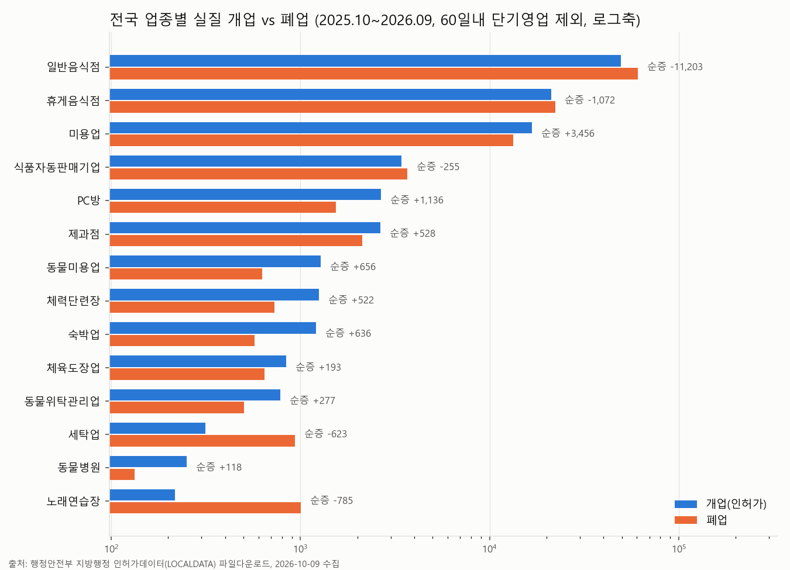
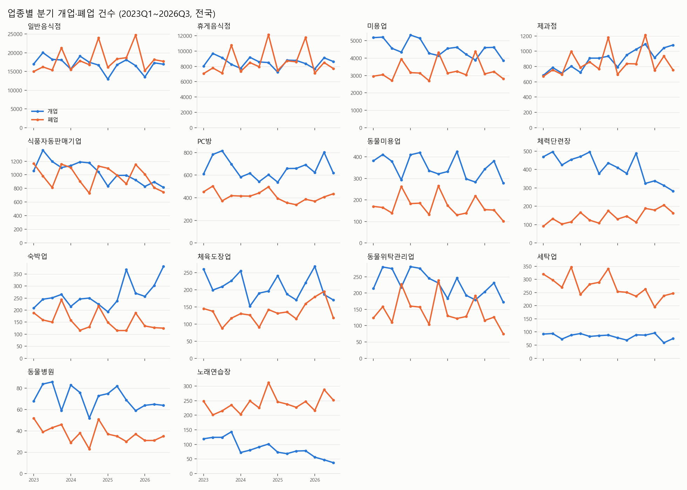
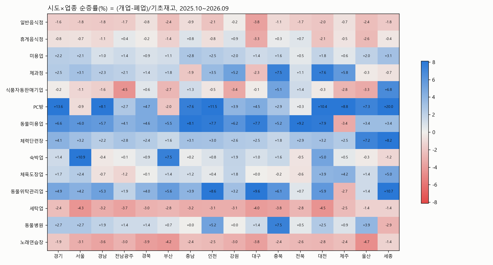
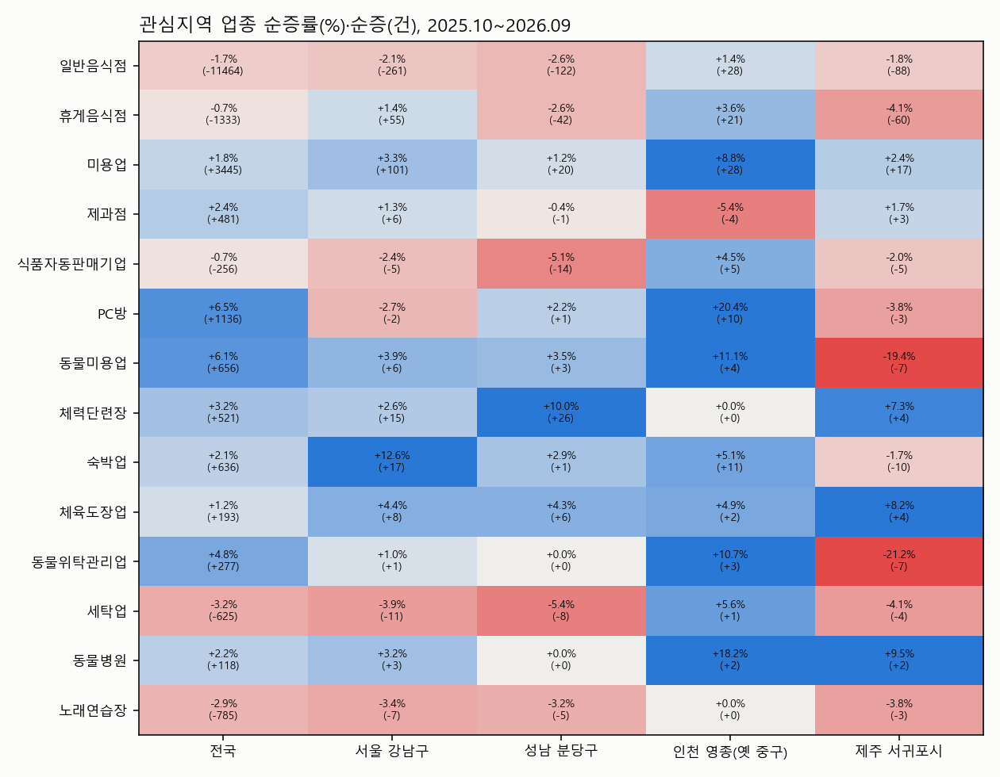
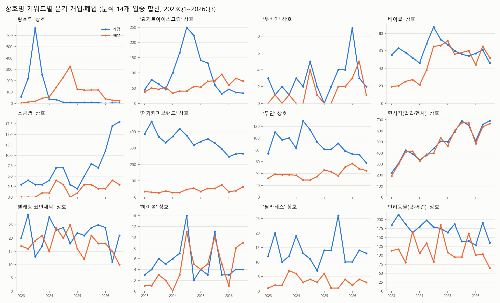

# 07. 지방행정 인허가(LOCALDATA)로 본 업종별 개·폐업과 상권 흐름

작성일 2026-10-09 · 데이터: 행정안전부 지방행정 인허가데이터 14개 업종 전국 전수 파일(2026-10-07~08 기준)

---

## ① 핵심 요약 (5줄)

1. **음식점은 문을 여는 곳보다 닫는 곳이 더 많습니다.** 최근 12개월(2025.10~2026.09) 일반음식점은 실질 개업 49,565건, 폐업 60,768건으로 순감 −11,464곳(재고 대비 −1.7%)입니다. 호프/통닭(−4.0%), 분식(−4.0%), 정종/소주방(−5.6%), 식육(숯불구이) 업태가 감소를 주도했고, 16개 시도 모두 순감입니다.
2. **늘어나는 업종은 미용업(+3,445곳), PC방(+1,136곳, 순증률 +6.5%), 동물미용(+6.1%), 동물위탁관리(+4.8%), 체력단련장(+3.2%), 제과점(+2.4%), 숙박업(+2.1%)입니다.** 줄어드는 업종은 노래연습장(폐업이 개업의 4.6배), 세탁업(3.0배), 일반음식점, 식품자동판매기업입니다.
3. **팝업스토어 때문에 개업 통계가 부풀려져 있습니다.** 휴게음식점 개업의 37%(12,520건)와 제과점 개업의 36%는 60일 안에 폐업한 단기 인허가입니다(상호에 '(한시적)'이 붙은 백화점 팝업·축제 부스 등). 강남구 휴게음식점은 이 비율이 57%, 분당구는 61%여서 원자료를 그대로 쓰면 해석이 크게 틀어집니다.
4. **반짝 유행 업종의 주기가 인허가 데이터에 그대로 남아 있습니다.** '탕후루' 상호 개업은 2023년 1,196건 → 2024년 85건 → 2025년 22건이었고, 폐업은 2024년 751건, 2025년 475건이었습니다. '요거트아이스크림' 개업은 2024년 738건으로 정점을 찍은 뒤 2025년 364건으로 줄었고, 2025년 폐업(294건)이 2024년(168건)보다 많습니다. 소금빵·두바이·젤라또는 아직 늘고 있지만 규모가 작습니다.
5. **관심지역은 서로 다르게 움직입니다.** 강남구는 숙박(+12.6%)·미용(+3.3%)이 늘고 음식점·노래방·세탁은 순감입니다. 분당은 헬스장(+10.0%)이 늘고 음식·카페·자판기는 순감입니다. 영종(인천 영종구)은 음식점까지 포함해 거의 모든 업종이 순증해 유일하게 확장 중인 상권입니다. 서귀포는 숙박 개업이 31건에서 6건으로 줄고 카페(−4.1%)·펫서비스도 순감해 관광 상권이 식어 가는 신호를 보입니다.

---

## ② 데이터 출처·수집일·표본 크기

| 항목 | 내용 |
|---|---|
| 1차 출처 | 행정안전부 지방행정 인허가데이터 업종별 전체 파일: `https://file.localdata.go.kr/file/{업종}/info` (공공데이터포털 파일데이터의 '기관자체 다운로드' URL, 예: [data.go.kr/data/15045016](https://www.data.go.kr/data/15045016/fileData.do)). 로그인은 필요 없지만 브라우저 User-Agent를 넣어야 받을 수 있습니다(없으면 403). |
| 수집일시 | 2026-10-09 13:47~13:59 (KST). 파일 내 최신 인허가일자는 2026-10-07~08입니다. |
| 대상 업종(14) | 일반음식점, 휴게음식점(카페·편의점 등), 제과점, 노래연습장, 체력단련장, PC방(인터넷컴퓨터게임시설제공업), 숙박업, 미용업, 세탁업, 동물병원, 동물미용업, 동물위탁관리업, 식품자동판매기업(무인 자판기), 체육도장업 |
| 표본 | 원본 4,124,409행(전국 전수, 일반음식점만 2,302,861행) 중 분석용 2,226,529행. 2019년 이전에 폐업한 과거 업소만 뺐기 때문에 최근 개·폐업 집계와 현재 재고 계산에는 영향이 없습니다. |
| 분석 기간 | 최근12M = 2025.10~2026.09, 직전12M = 2024.10~2025.09, 전전12M = 2023.10~2024.09, 분기 추이 = 2023Q1~2026Q3 |
| 보조 출처(웹) | 국세청 폐업자 통계 보도([MTN 2026-06-30](https://news.mtn.co.kr/news-detail/2026063016075460848), [머니투데이 2025-06-16](https://www.mt.co.kr/living/2025/06/16/2025061520590927492)), LOCALDATA의 공공데이터포털 통합([경향신문 2026-01-25](https://www.khan.co.kr/article/202601251400011/)), 탕후루·요아정 업계 보도([데일리안](https://www.dailian.co.kr/news/view/1389494/), [GQ Korea 2024-12](https://www.gqkorea.co.kr/2024/12/02/탕후루-요아정-그리고-2024-fb-트렌드-결산/)) |

**정의**
- 개업 = 인허가일자 기준, 폐업 = 영업상태 '폐업'이고 폐업일자 기준입니다. '취소/말소'(직권말소 등)는 폐업에서 뺐습니다.
- 순증률 = (개업 − 폐업) ÷ 기간 시작 시점의 재고(영업 중 업소 수)
- **실질 개업·폐업** = 인허가 후 60일 이내에 폐업한 '단기 영업'(팝업·행사 부스 등)을 뺀 값입니다. 단기 영업은 같은 기간 안에 열고 닫히므로 순증에는 거의 영향이 없습니다.
- 관심지역은 주소로 판정했습니다. '성남시 분당구' 포함, 서울 '강남구', '서귀포시' 포함, 인천 '영종구'(개방자치단체코드 3491000) 또는 옛 중구 영종지역 법정동(운서·중산·운남·운북·을왕·남북·덕교·무의)입니다. 데이터에는 2026년 인천 행정체제 개편이 이미 반영되어 있습니다(영종구·제물포구·서해구·검단구).
- 시도는 16개입니다. 광주·전남은 데이터상 '전남광주통합특별시'여서 '전남광주'로 합쳤습니다.

---

## ③ 상세 분석

### 3-1. 전국 업종별 개·폐업 (최근12M vs 직전12M)



| 업종 | 실질개업 직전→최근 | 실질폐업 직전→최근 | 단기(60일내) 개업 | 순증(최근12M) | 순증률 | 실질 폐업/개업 | 현재 영업 중 |
|---|---|---|---|---|---|---|---|
| 일반음식점 | 51,246 → 49,565 (−3.3%) | 63,676 → 60,768 | 14,764 | −11,464 | −1.67% | 1.23 | 675,948 |
| 휴게음식점 | 22,355 → 21,241 (−5.0%) | 25,962 → 22,313 | 12,520 | −1,333 | −0.66% | 1.05 | 199,301 |
| 미용업 | 17,330 → 16,771 (−3.2%) | 13,541 → 13,315 | 179 | +3,445 | +1.78% | 0.79 | 196,609 |
| 식품자동판매기업 | 3,804 → 3,419 (−10.1%) | 4,025 → 3,674 | 45 | −256 | −0.65% | 1.07 | 39,035 |
| PC방 | 2,422 → 2,672 (**+10.3%**) | 1,545 → 1,536 | 61 | **+1,136** | **+6.47%** | 0.57 | 18,678 |
| 제과점 | 2,261 → 2,655 (**+17.4%**) | 2,119 → 2,127 | 1,477 | +481 | +2.43% | 0.80 | 20,325 |
| 동물미용업 | 1,372 → 1,282 | 704 → 626 | 3 | +656 | +6.13% | 0.49 | 11,379 |
| 체력단련장 | 1,708 → 1,253 (**−26.6%**) | 562 → 731 (**+30.1%**) | 4 | +521 | +3.17% | 0.58 | 16,938 |
| 숙박업 | 1,014 → 1,207 (**+19.0%**) | 587 → 571 | 3 | +636 | +2.08% | 0.47 | 31,279 |
| 체육도장업 | 792 → 841 | 521 → 648 (+24.4%) | 3 | +193 | +1.16% | 0.77 | 16,795 |
| 동물위탁관리업 | 851 → 781 | 617 → 504 | 5 | +277 | +4.76% | 0.65 | 6,100 |
| 세탁업 | 313 → 314 | 1,073 → 937 | 4 | −625 | −3.25% | **2.98** | 18,590 |
| 동물병원 | 299 → 251 (−16.1%) | 153 → 133 | 1 | +118 | +2.19% | 0.53 | 5,512 |
| 노래연습장 | 318 → 218 (**−31.4%**) | 1,022 → 1,003 | 0 | −785 | −2.87% | **4.60** | 26,566 |

분기별 추이는 아래와 같습니다. 체력단련장은 개업이 분기 400~500건에서 2026년 280~340건으로 줄었고, 폐업은 2026Q2 206건으로 2023년 이후 가장 많았습니다.



**업태별 세부 (최근12M, 업태 = 인허가상 세부 분류)**

| 업종·업태 | 개업 직전→최근 | 폐업(최근) | 순증률 | 해석 |
|---|---|---|---|---|
| 일반음식점·한식 | 25,977 → 25,261 | 28,735 | −1.15% | 규모가 가장 커서 순감 −3,474곳 |
| 일반음식점·호프/통닭 | 3,660 → 3,378 | 5,832 | −4.01% | 주점형 업태가 가장 많이 줄어듦 |
| 일반음식점·정종/대포집/소주방 | 594 → 537 | 1,323 | −5.61% | 〃 |
| 일반음식점·분식 / 경양식 | 2,752→2,537 / 2,677→2,532 | 3,936 / 3,696 | −4.0% / −3.8% | 저가 외식도 순감 |
| 일반음식점·식육(숯불구이) | 2,375 → 1,901 (−20%) | 2,832 | −2.43% | 고깃집 창업 급감 |
| 일반음식점·외국음식전문점 | 1,176 → 1,216 | 909 | **+4.93%** | 아시아 음식 성장 |
| 일반음식점·감성주점 | 287 → 318 | 175 | **+10.9%** | 소규모 업태 성장 |
| 일반음식점·푸드트럭(신설) | 0 → 205 | 13 | 신규 | 일반음식점 업태에 푸드트럭이 새로 생김 |
| 휴게음식점·커피숍 | 9,598 → 9,143 | 9,875 | −0.92% | 카페 재고 78,705곳으로 정체·순감 전환 |
| 휴게음식점·편의점 | 2,926 → 2,706 | 2,868 | −0.48% | 편의점 출점도 순감 |
| 휴게음식점·아이스크림 | 608 → 311 (**−49%**) | 332 | −0.95% | 요거트아이스크림 붐이 끝남 |
| 휴게음식점·다방 | 249 → 267 | 662 | −5.21% | 구형 업태 퇴장 |
| 휴게음식점·푸드트럭 | 1,064 → 876 | 504 | +10.2% | |
| 미용업·메이크업 / 네일 / 피부 / 일반 | — | — | +8.3% / +2.2% / +1.9% / +1.1% | 메이크업·속눈썹·헤드스파가 성장 |
| 숙박업·숙박업(생활) | 712 → 885 | 141 | **+11.3%** | 서울 종로·중구의 스테이/호스텔 |
| 숙박업·여관업 / 여인숙 | 59→41 / 6→1 | 295 / 51 | −1.5% / −3.3% | 구형 숙박 퇴장 |
| 세탁업·일반세탁 | 269 → 242 | 856 | −3.40% | 동네 세탁소 감소 |
| 세탁업·빨래방업 / 운동화전문 | 6→8 / 11→16 | 19 / 45 | −3.7% / −5.9% | 셀프빨래방도 '세탁업' 신고 기준으로는 늘지 않음(자유업이라 신고 누락 가능) |
| 체육도장업·권투 | 245 → 279 | 70 | **+9.6%** | 복싱 피트니스 인기 |

### 3-2. 평균 영업기간 (최근12M에 폐업한 업소)

| 업종 | 폐업 | 평균 영업년수 | 중앙값 | 1년 안에 폐업 | 3년 안에 폐업 | 10년 이상 영업 |
|---|---|---|---|---|---|---|
| 일반음식점 | 75,793 | 7.1 | 3.8 | 24.9% | 44.3% | 24.2% |
| 휴게음식점 | 35,094 | 3.6 | 2.0 | 41.8%* | 59.3% | 8.8% |
| 제과점 | 3,651 | 4.1 | 1.3 | 47.5%* | 63.4% | 14.0% |
| PC방 | 1,597 | 4.8 | 3.0 | 22.1% | 50.3% | 12.5% |
| 미용업 | 13,505 | 7.1 | 4.7 | 9.5% | 34.9% | 21.4% |
| 체력단련장 | 736 | 7.5 | 5.0 | 7.7% | 26.6% | 22.6% |
| 동물미용 / 동물위탁 | 629 / 509 | 4.5 / 4.2 | 4.3 / 3.8 | 6.0% / 5.9% | 37.7% / 41.1% | 0% (2020년 무렵 신설 업종) |
| 노래연습장 | 1,003 | **20.0** | 22.6 | 0.2% | 2.3% | **83.5%** |
| 세탁업 | 943 | **20.0** | 20.5 | 2.5% | 7.7% | **74.9%** |
| 숙박업 | 574 | **22.6** | 22.3 | 3.3% | 10.8% | 70.0% |

\* 휴게음식점과 제과점의 '1년 안에 폐업' 비율에는 팝업(60일 이내) 영업이 포함되어 있습니다. 노래방·세탁소·여관은 신규 진입 없이 20년 넘게 영업한 업소가 은퇴하며 문을 닫는 '노후 퇴장형'입니다. 카페·제과·PC방은 3년 안에 절반 이상이 문을 닫는 '고회전형'입니다. 국세청 통계에서도 2025년 5년 이상 업력 사업자의 폐업이 역대 최다(31.7만 명)였다는 보도([MTN](https://news.mtn.co.kr/news-detail/2026063016075460848))와 같은 방향입니다.

### 3-3. 시도별 비교 (순증률 %, 최근12M)



- **일반음식점은 16개 시도 모두 순감**입니다. 대구가 −3.8%로 가장 크게 줄었고 부산 −2.4%, 울산 −2.4%, 인천 −2.1%가 뒤를 이었습니다. 강원(−0.2%)과 제주(−0.7%)는 감소폭이 작습니다. 순감 규모는 경기 −2,362곳, 서울 −2,157곳, 대구 −1,158곳, 부산 −1,034곳입니다.
- **휴게음식점은 대구(−3.3%)·울산(−2.6%)·대전(−2.1%)이 순감**했고, 강원·충남·전북·전남광주·충북은 소폭 순증했습니다. 카페가 수도권·광역시에서는 포화되었고, 지방에서는 아직 확산 중이라는 뜻으로 볼 수 있습니다.
- **PC방은 세종(+20%)·경기(+13.6%, +576곳)·인천(+11.5%)·대전(+10.4%)이 순증을 이끌었고, 서울(−0.9%)과 부산(−2.0%)만 순감**했습니다. 최근12M PC방 개업 상호 상위는 '대박PC·골드PC·행운PC·로또PC·잭팟PC·마카오PC' 같은 이름입니다. 사행성을 연상시키는 상호가 연 230~300건 개업(PC방 개업의 약 10%)했으므로, 일반 게임 PC방과 다른 수요가 섞여 있을 가능성을 함께 봐야 합니다(추정).
- **숙박업은 서울(+10.9%, +274곳)과 부산(+7.5%)이 순증했고, 서울 개업은 직전 대비 +274%**입니다. 서울 개업 상위 지역은 종로구 112건과 중구 110건이며, '스테이·호스텔' 상호가 많아 외국인 관광 수요를 겨냥한 소형 숙박으로 보입니다.
- 노래연습장과 세탁업은 모든 시도에서 순감했습니다.

### 3-4. 관심지역 특이사항



| 관심지역 | 일반음식점 순증(률) | 휴게음식점 | 미용업 | 체력단련장 | 숙박업 | 특이사항 |
|---|---|---|---|---|---|---|
| 서울 강남구 | −261 (−2.1%), 실질개업 1,168→1,045 | +55 (+1.4%) | +101 (+3.3%) | +15 (개업 80→33) | **+17 (+12.6%)** | 휴게음식점 개업의 57%, 제과점 개업의 55%가 60일 이내 폐업한 팝업입니다(백화점·코엑스 등). 음식점 폐업 업소의 중앙 영업기간은 3.0년(전국 3.8년)으로 짧습니다. 노래방 개업 0건, 세탁 −11곳. |
| 성남 분당구 | −122 (−2.6%) | −42 (−2.6%) | +20 | **+26 (+10.0%)** | +1 | 헬스장만 확장하고 음식·카페·자판기(−5.1%)·세탁(−5.4%)은 순감인 '성숙 주거 상권'입니다. 휴게음식점 개업의 61%가 팝업(서현·정자 백화점 추정)입니다. |
| 인천 영종(영종구) | **+28 (+1.4%)** | **+21 (+3.6%)** | **+28 (+8.8%)** | 0 | +11 (+5.1%) | 관심지역 가운데 유일하게 음식점까지 순증했습니다. PC방 +20%, 동물미용·위탁 +11%로 인구 유입형 신도시 패턴입니다. 다만 음식점 실질 개업은 341→272건(−20%)으로 증가 속도가 둔화했고, 폐업 업소의 중앙 영업기간이 2.2년으로 짧습니다(고회전). |
| 제주 서귀포시 | −88 (−1.8%) | **−60 (−4.1%)** | +17 | +4 | **−10 (개업 31→6)** | 숙박 개업이 급감해 순감으로 돌아섰습니다. 카페 순감, 동물미용(−19%)·동물위탁(−21%) 축소. 음식점 개업 가운데 35.5%가 60일 이내 폐업(축제·행사 부스)이었습니다. 관광 수요가 둔화하는 신호입니다. |

### 3-5. 신규·반짝 업종 키워드 (상호명, 14개 업종 합산)



| 키워드 | 개업 2023 / 2024 / 2025 / 2026(1~9월) | 폐업 2023 / 2024 / 2025 / 2026 | 단계 |
|---|---|---|---|
| 탕후루 | 1,196 / 85 / 22 / 5 | 72 / 751 / 475 / 91 | **붐→붕괴 완료** (2023Q2 정점, 1년 뒤 폐업 정점) |
| 요거트아이스크림(요아정 등) | 231 / **738** / 364 / 115 | 185 / 168 / 294 / 214 | **정점 지나 하강**(2024Q2~Q3 정점, 폐업이 개업을 넘어섬) |
| 마라(탕) | 956 / 494 / 468 / 405 | 395 / 629 / 562 / 361 | 2023 정점 뒤 안정화 |
| 베이글 | 228 / 274 / 237 / 164 | 91 / 190 / 245 / 161 | 2024 정점, 개업 ≈ 폐업 |
| 저가커피 브랜드(메가·컴포즈·빽다방·더벤티·매머드) | 1,550 / 1,484 / 1,322 / 777 | 128 / 157 / 216 / 135 | 출점 둔화, 폐업 증가(포화 진입) |
| 무인 | 381 / 419 / 331 / 203 | 147 / 130 / 176 / 150 | 2024 정점 뒤 하강 |
| 젤라또 | 53 / 94 / 115 / 73 | 32 / 71 / 91 / 69 | 상승 중(소규모) |
| 소금빵 | 13 / 21 / 22 / **46** | 1 / 8 / 9 / 9 | **부상 중**(2026 급증, 초기 단계) |
| 두바이 | 7 / 12 / 10 / 14 | 2 / 5 / 4 / 9 | 메뉴 유행이라 업소명에는 거의 쓰이지 않음 |
| 포케 / 샐러드 | 105/154/133/59 · 214/146/149/103 | — | 포케 정체, 샐러드 축소 |
| PT·퍼스널 / 크로스핏 | 421/425/457/269 · 76/81/84/28 | 56/97/115/102 · 1/6/13/6 | 크로스핏 개업 급감 |
| 한시적(팝업·행사) | 1,339 / 1,662 / **2,430** / 1,856 | — | **매년 빠르게 증가하는 '팝업 경제'** |
| 축제·행사 부스 | 일반음식점 348 / 618 / 838 / 568 | — | 지역축제 임시 영업 증가 |

상호명 토큰 분석(최근12M vs 전전12M 개업 비교):
- **휴게음식점에서 사라진 상호 토큰**은 탕후루(56→2), 유키모찌(51→2), 요거트아이스크림의정석(43→2), 카페요아정(53→8), 빽다방(199→46), 매머드(42→11), 팥붕슈붕(37→9), 보드게임카페(41→9)입니다. **새로 늘어난 토큰**은 치즈케이크(8→167), 오지상(7→147), 오사카(9→147), 딸기모찌·버터·베이크샵 등 디저트·일본풍입니다.
- **일반음식점에서 늘어난 토큰**은 혼술바(9→293), 슈퍼크리스피(1→60), 토핑몬스터피자(6→75), 큰손닭강정, 정직화벌집삼겹 같은 신생 프랜차이즈와 축제 부스입니다. **줄어든 토큰**은 포동푸딩·노티드(0건), 명륜진사갈비(67→5), 빽보이피자(39→3), 프랭크버거(71→22), 타코야끼, 샤브올데이(29→6), 애슐리퀸즈입니다.
- **미용업에서 늘어난 토큰**은 맨즈(헤어)·래쉬·속눈썹·헤드스파·염색방·스튜디오이고, **줄어든 토큰**은 네일(616→509)·미장원·슈가링왁싱입니다.

---

## ④ 상권 흐름 인사이트·사업 기회

1. **음식점 상권은 '주점·고깃집 → 외국음식·감성주점·디저트'로 업태 교체가 진행 중입니다.** 순감 속에서도 외국음식전문점(+4.9%)과 감성주점(+10.9%)은 늘고 있습니다. 창업하려면 한식·호프보다 아시아 음식이나 소형 주류 공간이 상대적으로 유리하고, 폐업이 많은 업태의 중고 설비·철거·인테리어 재활용 수요는 커집니다.
2. **'팝업 경제'가 독립된 시장으로 커지고 있습니다.** '(한시적)' 인허가는 2023년 1,339건에서 2025년 2,430건으로 늘었고, 휴게음식점 개업의 37%가 60일 안에 닫는 단기 영업입니다. 팝업용 임시 인허가 대행, 집기·주방 렌탈, 팝업 운영 SaaS(재고·POS·인력), 백화점·축제 부스 매칭 서비스가 유망합니다. 같은 이유로 상권분석 툴은 '(한시적)'과 60일 이내 폐업 업소를 반드시 걸러야 합니다. 이 필터가 차별화 포인트가 될 수 있습니다.
3. **디저트 유행 주기는 약 12~18개월입니다.** 탕후루는 정점에서 약 4분기 뒤 폐업이 정점을 찍었고, 요거트아이스크림은 정점 후 약 3~4분기 만에 폐업이 개업을 넘어섰습니다. 인허가 상호 키워드를 분기마다 모니터링하면 '개업 급증 → 2분기 연속 감소'를 붕괴 신호로 미리 잡을 수 있습니다. 가맹 본부 리스크 점검, 창업자 경고 서비스, 중고 장비 매입 타이밍 판단에 쓸 수 있습니다. 현재 초기 상승 단계로 보이는 키워드는 소금빵, 젤라또, 치즈케이크, 일본풍(오사카·오지상) 디저트입니다.
4. **펫 서비스(동물미용 +6.1%, 동물위탁 +4.8%)와 미용(메이크업·속눈썹·헤드스파·남성 헤어)은 꾸준히 순증하는 '개인 케어' 업종입니다.** 폐업/개업 비율이 0.5~0.8로 안정적입니다. 예약·고객관리 SaaS, 펫 호텔·데이케어 보험, 소모품 정기배송의 수요 기반으로 볼 수 있습니다.
5. **헬스장은 사이클이 꺾이고 있습니다.** 개업 −27%, 폐업 +30%이고 강남은 개업이 80건에서 33건으로 줄었습니다. 반면 권투 도장(+9.6%)은 성장 중입니다. 대형 헬스장 대신 소형·특화 운동(복싱, PT 스튜디오)으로 옮겨 가는 흐름이므로, 헬스장 폐업 증가에 따른 회원권 환불·양도 플랫폼이나 중고 운동기구 유통이 틈새 시장입니다.
6. **노래방·세탁소·여관은 신규 진입 없이 노후 업소가 은퇴하는 '고령 퇴장형'입니다.** 폐업 업소의 평균 영업기간이 20년 이상입니다. 신규 경쟁이 거의 없으므로 남은 업소를 대상으로 한 사업승계·인수 중개, 세탁 수거·배달(비대면 세탁) 대체 서비스가 기회입니다.
7. **서울 도심 소형 숙박(종로·중구 '스테이/호스텔') 개업이 직전 대비 약 3.7배입니다.** 외국인 관광 수요에 맞춘 무인 체크인·청소 매칭·다국어 CS 툴 수요가 커질 가능성이 있습니다. 반대로 서귀포는 숙박 개업이 급감했으므로 제주 숙박 관련 투자는 신중해야 합니다.
8. **영종(영종구)은 관심지역 가운데 유일한 확장 상권입니다**(음식·카페·미용·PC방·펫 모두 순증). 다만 음식점 실질 개업이 20% 줄었고 폐업 업소의 영업기간이 짧아 과잉 진입 위험도 공존합니다. 입점을 검토한다면 생활 서비스(미용·펫·PC방)가 음식점보다 안정적입니다.

---

## ⑤ 한계와 다음 단계

**한계**
- 인허가 데이터는 허가·신고 업종만 담습니다. 무인 아이스크림 할인점, 셀프 사진관, 스터디카페, 대부분의 코인빨래방, 필라테스 같은 **자유업은 빠져 있어** '무인점포' 추세는 상호에 '무인'이 들어간 업소와 식품자동판매기업으로만 간접 관찰했습니다.
- 폐업 신고 지연이나 직권말소('취소/말소', 폐업으로 집계하지 않음) 때문에 최근 1~2개월 폐업이 덜 잡힐 수 있습니다. PC방은 취소/말소가 6,910건이나 됩니다.
- 60일 기준 단기 영업 판정은 휴리스틱입니다. 상호 키워드(대박·로또 등)로 한 사행성 추정은 가설일 뿐 사실 확인이 아닙니다.
- 업태명은 지자체 입력 관행에 따라 다릅니다. 일반음식점의 '통닭(치킨)·까페·패스트푸드' 업태는 과거 코드라 신규 개업이 거의 없습니다.
- 관심지역은 주소 문자열로 판정했으므로 주소 누락 업소는 빠질 수 있습니다. 영종은 업종별 건수가 작아 순증률 변동이 큽니다.
- 매출·폐업 사유 같은 질적 정보는 없습니다.

**다음 단계**
1. 공공데이터포털 Open API(`apis.data.go.kr/1741000/{업종}/info`)로 키(`LOCALDATA_API_KEY`)를 발급받아 `DAT_UPDT_PNT` 기준으로 매일 증분 수집하고, 키워드 붕괴 신호를 자동 알림으로 보냅니다.
2. 소상공인시장진흥공단 상가(상권)정보와 결합해 자유업(무인점포·스터디카페·필라테스)을 보완합니다.
3. 좌표(EPSG:5174)를 쓰면 행정동·골목 단위 핫스팟(예: 성수·연남·영종 운서동)을 분석할 수 있습니다. 이번 경량화에서는 좌표를 뺐으므로 01 스크립트의 컬럼 목록에 추가해 다시 받으면 됩니다.
4. 네이버 데이터랩 검색량과 키워드(소금빵·젤라또 등)를 교차 검증해 '검색 급증 → 인허가 증가' 시차를 측정합니다.
5. 국세청 100대 생활업종 월별 사업자 수와 비교해 인허가 통계의 대표성을 확인합니다.

---

## ⑥ 재실행 방법

```powershell
cd "G:\내 드라이브\100_AI개발\200_개발\20261009_최근트랜드동향파악하기\07_인허가_개폐업_상권"
# 1) 파일 다운로드(로그인 불필요, 약 1.3GB 스트리밍 → 경량 csv.gz 약 125MB). 특정 업종만: 뒤에 slug 나열
python -I scripts\01_download_localdata_files.py
#    예) python -I scripts\01_download_localdata_files.py pc_bangs karaoke_rooms
# 2) 분석 + 차트
python -I scripts\02_analyze.py
# (선택) Open API 수집: 키가 있을 때만 동작
$env:LOCALDATA_API_KEY = "<공공데이터포털 Decoding 키>"
python -I scripts\00_localdata_api.py general_restaurants --org 3220000 --from 20250101
```

- 분석 기간을 바꾸려면 `scripts/02_analyze.py` 상단의 `P`, `END`를 수정합니다. 관심지역 규칙은 `scripts/common.py`의 `load()`에 있습니다.
- 사내망에서 SSL 오류가 나면 `truststore`를 설치합니다(스크립트가 자동으로 주입합니다).

**생성 파일**
- `scripts/00_localdata_api.py`: Open API 수집기(LOCALDATA_API_KEY 필요)
- `scripts/01_download_localdata_files.py`: 업종별 전체 파일 다운로드 및 경량화
- `scripts/common.py`: 로더(시도·시군구·관심지역·단기영업 판정)
- `scripts/02_analyze.py`: 집계와 차트
- `data/raw/localdata_file/*.csv.gz` (14개 업종), `_download_meta.json`, `_orgcodes.csv`, `_download_log.txt`
- `data/processed/`: national_periods, sido_periods, interest_area_periods, biztype_periods, closure_duration, quarterly_open_close, keyword_quarterly, name_token_trends (.csv), `_sample.json`
- `charts/`: c1_national_open_close_12m, c2_quarterly_by_industry, c3_sido_net_rate_heatmap, c4_interest_area_heatmap, c5_keyword_quarterly (.png)
